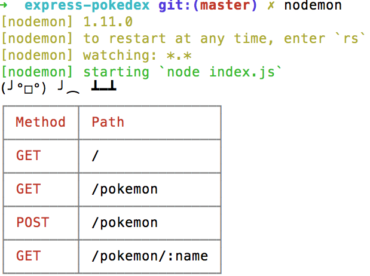

# rowdy (╯°□°）╯︵ ┻━┻ &middot; [](https://github.com/hoten/rowdy/blob/master/LICENSE) [](https://www.npmjs.com/package/rowdy-logger) [](https://coveralls.io/github/Hoten/rowdy?branch=master) [](https://travis-ci.org/Hoten/rowdy)

Render a nice table of your Express routes

Supports Express v. 3, 4, and 5



## Installation

```sh
npm install --save rowdy-logger
```

## Usage

```javascript
var express = require('express')
var rowdy = require('rowdy-logger')

var app = express()
var rowdyResults = rowdy.begin(app)

// ... apply your routes ...

var server = app.listen(process.env.PORT || 3000, function() {
    rowdyResults.print()
})
```
